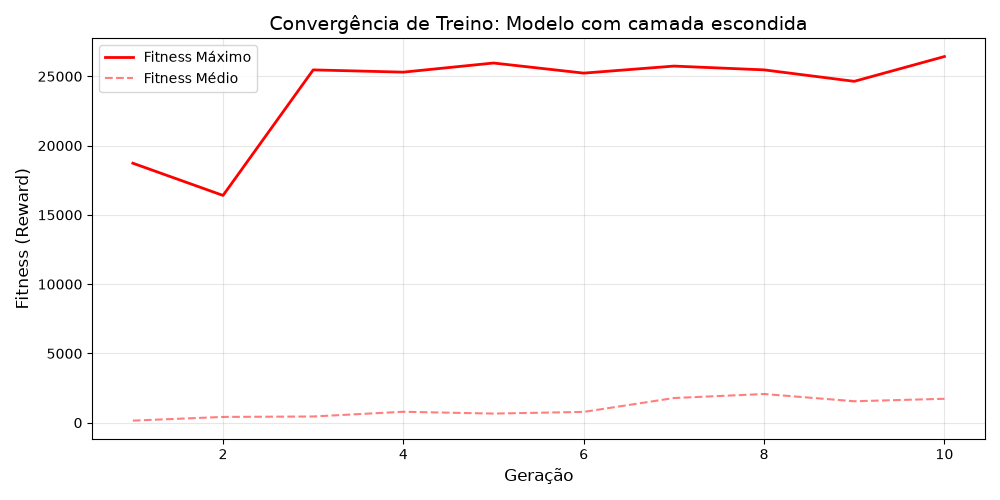

#  SI2 - Space Invaders: Evolução e Adaptação

## Grupo 2 (Francisco Carvalho - 114492; João Viegas - 113144)

Este relatório descreve o processo de desenvolvimento de um agente autónomo para o jogo Space Invaders, utilizando o algoritmo **NEAT**. O projeto é marcado por uma mudança radical na lógica do motor de jogo a meio do desenvolvimento, o que forçou uma reavaliação da arquitetura e da função de recompensa.

---

## 1. Primeira Fase: Engenharia de Features vs. Complexidade

No início do projeto, com o motor de jogo original (cooldown de 0.3s e velocidade constante), explorámos duas filosofias distintas:

- **Modelo A (Engenharia de Features):** Rede linear (0 camadas escondidas) com 11 inputs processados. Atingiu a marca de **50.000 pontos** rapidamente, revelando-se eficiente mas rígida.
- **Modelo B (Complexidade Estrutural):** Rede com **1 camada escondida (6 neurónios)** e apenas **2 inputs base** (distância relativa $dx$ e altura $y$).

**Performance no Motor Original (Média de 10 jogos / 100k steps):**

| Modelo | Score Médio | Vidas |
| :--- | :--- | :--- |
| **NEAT Modelo A** | **107.669** | 2.8 |
| **NEAT Modelo B** | **122.435** | 3.0 |

Nesta fase, o modelo com camada escondida já superava a solução linear em consistência e pontuação.

---

## 2. O Ponto de Inflexão: Atualização do Motor de Jogo

A atualização do código base introduziu variáveis que alteraram drasticamente a dificuldade:

1. **Dificuldade Dinâmica:** Os aliens passaram a acelerar a movimentação lateral conforme o score aumentava.
2. **Aumento de Cooldown:** O tempo entre disparos subiu de **0.3s para 0.5s**.

**Impacto:** O modelo linear perdeu a capacidade de adaptação, falhando os *timings* de interceptação. Tornou-se evidente que a relação entre a posição do alien e o disparo deixou de ser linear, exigindo neurónios escondidos para processar correlações complexas.

---

## 3. Segunda Fase: Refinação do Modelo Final

Focámos o desenvolvimento na expansão do modelo com camadas escondidas, adaptando-o às novas restrições:

### Expansão de Inputs (de 2 para 4)

Para mitigar o impacto do novo cooldown e da velocidade variável, o vetor de estado passou a incluir:

- **Sensor de Cooldown:** Permite à rede saber exatamente quando pode disparar, evitando o desperdício de frames.
- **Flag de Alinhamento:** Input booleano que indica se o alien está dentro de uma margem de erro ideal ($|dx| < 0.8$).

### Suavização da Recompensa (Reward Shaping)

Com o cooldown mais lento, o rácio de pontos por segundo baixou. As penalizações por *step* originais tornaram-se demasiado punitivas. Reduzimos a penalização temporal para garantir que o gradiente de aprendizagem se mantivesse positivo mesmo em fases de jogo mais lentas.

---

## 4. Avaliação e Resultados Finais

O modelo final (**4 inputs + 6 neurónios escondidos**) demonstrou uma resiliência total ao novo ambiente.

### Benchmark de Stress (Motor Atual - 100.000 Steps)

Submetemos o agente a 10 testes de longa duração:

| Métrica | Valor Médio (10 Jogos) |
| :--- | :--- |
| **Pontuação (Score)** | **88.676** |
| **Vidas Restantes** | **3,0** |
| **Passos de Simulação** | **100.000** |

> *Nota:* Num teste mais prolongado, o agente atingiu a marca dos **300.000 pontos**, perdendo apenas uma vida durante todo o percurso.

A descida do score absoluto (de ~122k para ~88k) não representa uma perda de inteligência, mas sim o aumento da dificuldade intrínseca do jogo, onde as *waves* demoram mais tempo a ser limpas devido ao cooldown da arma.

---

## 5. Instruções de Execução

1. `pip install -r requirements.txt`
2. `python3 -m server.server` (Iniciar Servidor)
3. `python3 -m agents.ml_agent` (Iniciar Agente Final)
4. [http://localhost:8765/](http://localhost:8765/) (Visualização)

---

## 6. Gráfico de Evolução de Fitness

---
*Evolução do fitness médio e máximo do modelo final.*